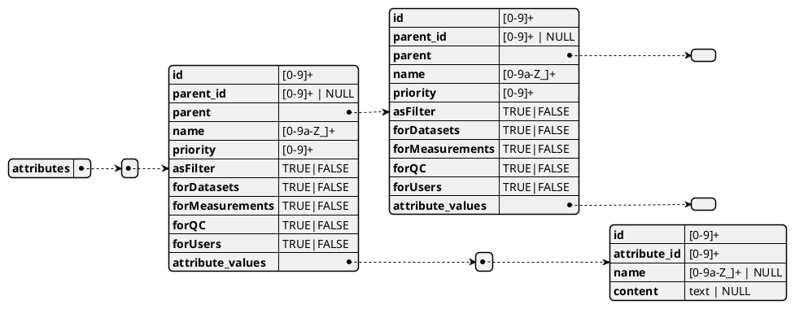
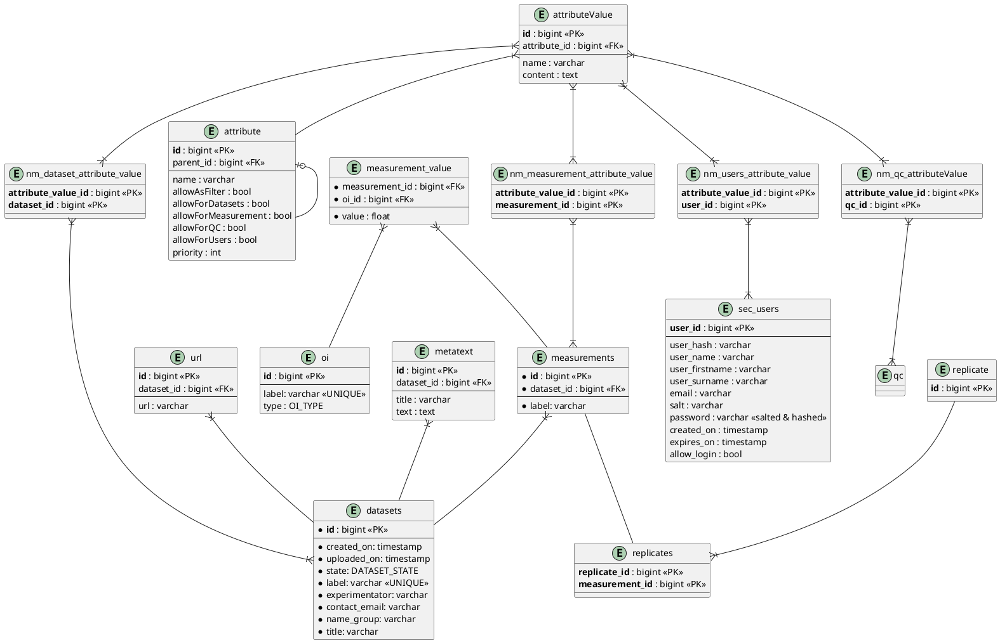

Preliminary design for new data layer and processing (2023-03-31).

---

# Class Design

# JSON Design

## Definition

```plantuml
@startjson
{
    "attributes": [
        {
            "id": "[0-9]+",
            "parent_id": "[0-9]+ | NULL",
            "parent": {
                "id": "[0-9]+",
                   "parent_id": "[0-9]+ | NULL",
                "parent": {},
                "name": "[0-9a-Z_]+",
                "priority": "[0-9]+",
                "asFilter": "TRUE|FALSE",
                "forDatasets": "TRUE|FALSE",
                "forMeasurements": "TRUE|FALSE",
                "forQC": "TRUE|FALSE",
                "forUsers": "TRUE|FALSE",
                "attribute_values": []
            },
            "name": "[0-9a-Z_]+",
            "priority": "[0-9]+",
            "asFilter": "TRUE|FALSE",
            "forDatasets": "TRUE|FALSE",
            "forMeasurements": "TRUE|FALSE",
                "forQC": "TRUE|FALSE",
            "forUsers": "TRUE|FALSE",
            "attribute_values": [
                {
                    "id": "[0-9]+",
                    "attribute_id": "[0-9]+",
                    "name": "[0-9a-Z_]+ | NULL",
                    "content": "text | NULL"
                }
            ]
        }
    ]
}
@endjson
```

# Database Design

```plantuml
@startuml
entity "oi" {
  **id** : bigint <<PK>>
  --
  label: varchar <<UNIQUE>>
  type : OI_TYPE
}

entity "measurement_value" as mv {
  * measurement_id : bigint <<FK>>
  * oi_id : bigint <<FK>>
  --
  * value : float
}

entity "measurements" as m {
  * **id** : bigint <<PK>>
  * dataset_id : bigint <<FK>>
  --
  *label: varchar
}

entity "datasets" as ds {  
  * **id** : bigint <<PK>>
  --
  * created_on: timestamp
  * uploaded_on: timestamp
  * state: DATASET_STATE
  * label: varchar <<UNIQUE>>
  * experimentator: varchar
  * contact_email: varchar
  * name_group: varchar
  * title: varchar
}

entity "attribute" as a {
  **id** : bigint <<PK>>
  parent_id : bigint <<FK>>
  --
  name : varchar
  allowAsFilter : bool
  allowForDatasets : bool
  allowForMeasurement : bool
  allowForQC : bool
  allowForUsers : bool
  priority : int
}

entity "attributeValue" as av {
  **id** : bigint <<PK>>
  attribute_id : bigint <<FK>>
  --
  name : varchar
  content : text
}

entity "nm_dataset_attribute_value" as nm_ds_av {
  **attribute_value_id** : bigint <<PK>>
  **dataset_id** : bigint <<PK>>
}

entity "nm_measurement_attribute_value" as nm_m_av {
  **attribute_value_id** : bigint <<PK>>
  **measurement_id** : bigint <<PK>>
}

entity "nm_users_attribute_value" as nm_u_av {
  **attribute_value_id** : bigint <<PK>>
  **user_id** : bigint <<PK>>
}


entity "nm_qc_attributeValue" as nm_qc_av {
  **attribute_value_id** : bigint <<PK>>
  **qc_id** : bigint <<PK>>
}

entity "sec_users" as u {
  **user_id** : bigint <<PK>>
  --
  user_hash : varchar
  user_name : varchar
  user_firstname : varchar
  user_surname : varchar
  email : varchar
  salt : varchar
  password : varchar <<salted & hashed>>
  created_on : timestamp
  expires_on : timestamp
  allow_login : bool
}

entity "replicate" as r {
    **id** : bigint <<PK>>
}

entity "replicates" as rs {
    **replicate_id** : bigint <<PK>>
    **measurement_id** : bigint <<PK>>
}

entity "metatext" as mt {
    **id** : bigint <<PK>>
    dataset_id : bigint <<FK>>
    --
    title : varchar
    text : text
}
entity "url" as url {
    **id** : bigint <<PK>>
    dataset_id : bigint <<FK>>
    --
    url : varchar
}

entity "qc" as qc {
}

mv }|-- oi
mv }|-- m
m }|-- ds
url }|-- ds

mt }|-- ds

a |o-- a
av }|-- a

av }|--|{ nm_ds_av
av }|--|{ nm_m_av
av }|--|{ nm_u_av
av }|--|{ nm_qc_av

nm_ds_av }|--|{ ds
nm_m_av }|--|{ m
nm_u_av }|--|{ u
nm_qc_av }|--|{ qc

r --|{ rs
m -- rs

@enduml
```
