Preliminary summary of Mitocube return values used, e.g., by the react front-end (2023-03-31).

---
<!--- TOC -->
* [Internally Used Data](#internally-used-data)
* [Client-Server Communication](#client-server-communication)
  * [/api/token/admin/valid](#apitokenadminvalid)
  * [/api/login](#apilogin)
  * [/api/features/details?filter:={str_filter}token={str}](#apifeaturesdetailsfilter--strfiltertokenstr)
  * [/api/data/summary?token={str}](#apidatasummarytokenstr)
  * [/api/data/filter/options](#apidatafilteroptions)
  * [/api/features/details?filter:={str_filter}token={str}](#apifeaturesdetailsfilter--strfiltertokenstr-1)
  * [/api/data/summary?token={str}](#apidatasummarytokenstr-1)
  * [/api/features/cards](#apifeaturescards)
  * [/api/features/db/info?featureID={str}token={str}](#apifeaturesdbinfofeatureidstrtokenstr)
  * [/api/dataset/details?dataID={str}&token={str}](#apidatasetdetailsdataidstrtokenstr)
  * [/api/dataset?token={str}&dataID={str}](#apidatasettokenstrdataidstr)
  * [/api/data/volcano?dataID={str}&grouping={str_grouping}&token={str}](#apidatavolcanodataidstrgroupingstrgroupingtokenstr)
  * [/api/data/heatmap?dataID={str}&token={str}&anovaDetails={str_anova}](#apidataheatmapdataidstrtokenstranovadetailsstranova)
<!-- TOC -->

---

# Internally Used Data

Documentation of the JSONs returned to the client (frontend) by the backend.

## DataHandling.py / Data.py

### Dataset.getMetaInformation():

Param information from a Dataset.

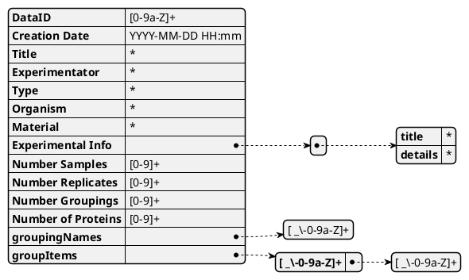

# Client-Server Communication

## /api/token/admin/valid

## /api/login
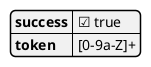

## /api/features/details?filter:={str_filter}token={str}

### Payload {str_filter}
Can be 'null' or ?
### Response
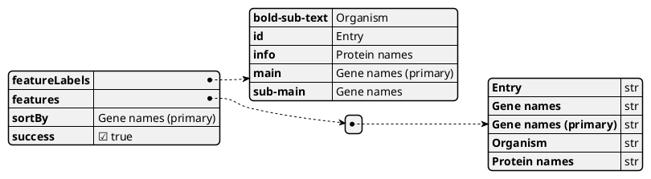

## /api/data/summary?token={str}
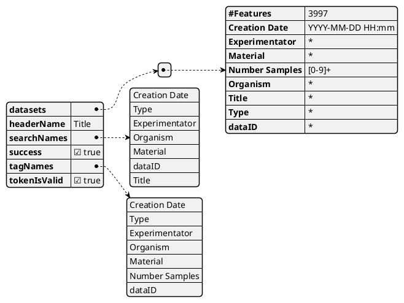

## /api/data/filter/options
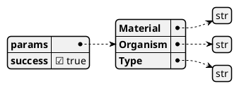

## /api/features/details?filter:={str_filter}token={str}
...

## /api/data/summary?token={str}
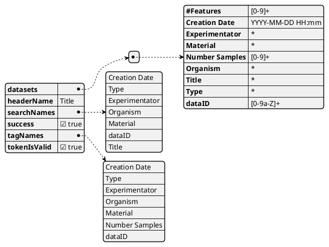

## /api/features/cards
### POST Payload
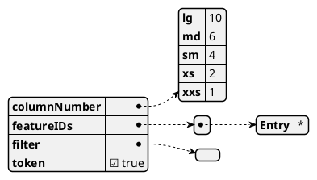
### Response
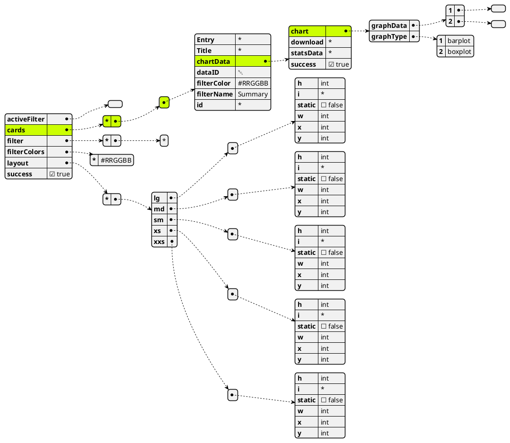

## /api/features/db/info?featureID={str}token={str}
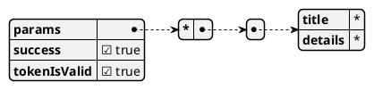

## /api/dataset/details?dataID={str}&token={str}
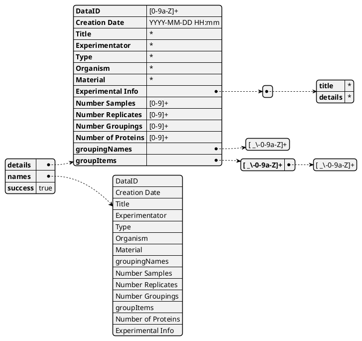

## /api/dataset?token={str}&dataID={str}
The field 'data' contains a tuple / array of rows. The first field is labeled "Key" and and holds the protein group or 
protein name. Following fields (highlighted) hold the column name as string with the 'intensity' as float value.
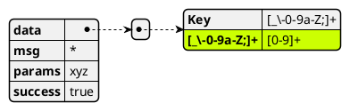

## /api/data/volcano?dataID={str}&grouping={str_grouping}&token={str}

### Payload {str_grouping}
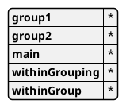
### Response
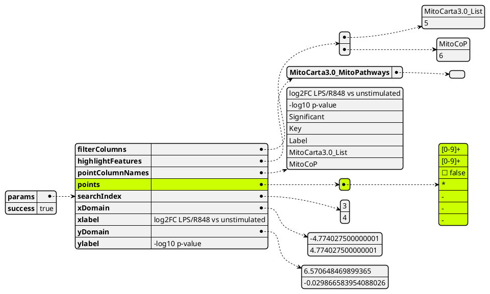

## /api/data/heatmap?dataID={str}&token={str}&anovaDetails={str_anova}
### Payload {str_anova}
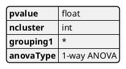
### Response

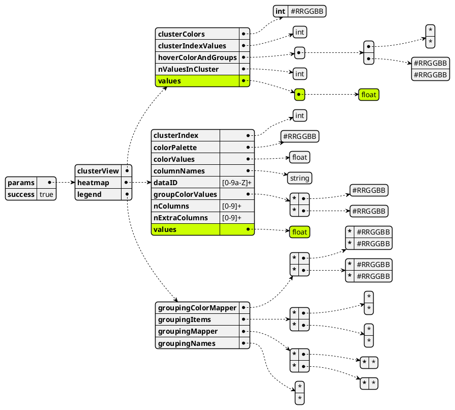

# Examples

## plantuml.com

Example from https://plantuml.com/json
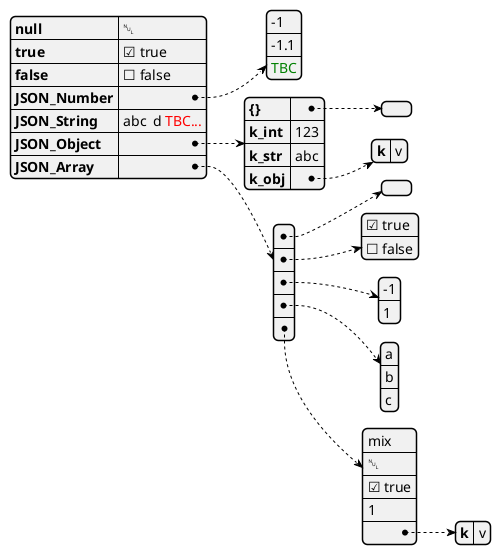