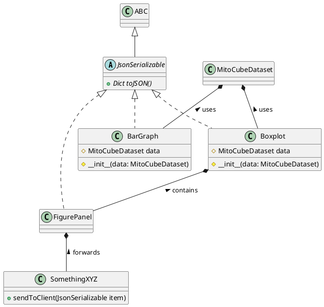

Preliminary design for new data layer and processing (2023-03-31).

---

# Data Layer / Handling

```plantuml
@startuml

package lib.DesignPatterns {
    class SingletonABCMeta extends ABCMeta {
        # {} _instances
        # Lock _lock
        + SingletonABCMeta __call__(*args, **kwargs)
    }
    
    class SingletonMeta extends type {
        # {} _instances
        # Lock _lock
        + SingletonMeta __call__(*args, **kwargs)
    }
}

package lib.data.DataHandling {
    abstract class MitoCubeDataset {
        # str _datasetId
        __
        + void __init__(str: datasetId)
        ..
        + str getId()
        + {abstract} Any getData()
        + {abstract} Any getMetaInformation()
    }
    
    class CachedDataset extends MitoCubeDataset{
        # Any _cached_data
        # Any _cached_meta
        + void __init__(datasetId: str, data=None: Any, Any: meta=None: Any) 
    }
    
    abstract class MitoCubeDataCollection {
        + {abstract} List[MitoCubeDataset] getData()
    }
    
    class CachedDataCollection extends MitoCubeDataCollection {
        # Dict[str, MitoCubeDataset] _cached_dat
        + void __init__(data: Dict[str, MitoCubeDataset])
    } 
    
    abstract class MitoCubeFeatures << (S,#FF7700) Singleton >> implements SingletonABCMeta {
    
    }
    
    abstract class MitoCubeDatabase << Singleton >> implements SingletonABCMeta {
        .. factory ..
        + {static} MitoCubeDatabase getDatabase()
        .. information ..
        + {abstract} bool contains(datasetIds: str)
        + {abstract} int getDatasetNumbers()
        + {abstract} float getSize()
        .. data ..
        + {abstract} MitoCubeDataset getDataset(datasetId: str)
        + {abstract} MitoCubeDataset getDataCollection(ids: List[str] = None)
        + {abstract} List[float] getOIAbundance(poi_id: int = None, poi_label: str = None)
        .. control ..
        + {abstract} _update()
    }
    
    abstract class MitoCubeDatabaseFactory << Singleton >> implements SingletonABCMeta {
        + {abstract} MitoCubeDatabase getDBObject(ids=None: List[str])
    }
    
    together {
        class MitoCubeDatabase
        class MitoCubeDataCollection
        class MitoCubeDataset
    }
    
    together {
        class CachedDataCollection
        class CachedDataset
    }
    
    abstract class SQLConnection << (S,#FF7700) Singleton >> implements SingletonABCMeta {
        # Connection conn
        __
        + __init__()
        + __del__()
        + __exit__()
        ..
        + {abstract} void openNewConnection()
        + {abstract} void closeConnection()
        + {abstract} Connection getConnection()
        + {abstract} {static} Connection getIndependentConnection()
    }
    
    MitoCubeDataset ..- MitoCubeDataCollection : is collection of <  
}

package lib.data.PostgreSQLHandling {
    class PostgreSQLDataset extends CachedDataset{
        # bool _isDataLoaded()
        # bool _isMetaLoaded()
    }
    
    class PostgreSQLDataCollection extends CachedDataCollection {
        # bool _isDataLoaded()
    }
    
    class PostgreSQLDatabase << (S,#FF7700) Singleton >> extends MitoCubeDatabase {
    }
    
    class PostgreSQLFeatures << (S,#FF7700) Singleton >> extends MitoCubeFeatures { }
    
    class PostgreSQLConnection << (S,#FF7700) Singleton >> extends SQLConnection { }
}
        
package lib.data.PandaFileHandling {     
    class PandaFileDataset extends CachedDataset{
        # str getFilename()        
    }
    
    class PandaFileDataCollection extends CachedDataCollection {
        # str getFilenames()
    }
    
    class PandaFileDatabase << (S,#FF7700) Singleton >> extends MitoCubeDatabase {
        # str folder
        # PandaFileDataCollection data
        # Dict[Dict[Any]] meatdata
        + str getFolder()
        + str getFilenames()
    }
    
    class PandaFileFeatures << (S,#FF7700) Singleton >> extends MitoCubeFeatures { }
    
    PandaFileDatabase *-- PandaFileDataCollection
    PandaFileDataCollection *-- PandaFileDataset
}
  
package lib.data.DataProcessing {
    class DataHelper {
        
    }
}

package lib.data.stat {
}

@enduml
```

# DataProcessing

```plantuml
@startuml

abstract class JsonSerializable extends ABC {
    + {abstract} Dict toJSON()
}

class Boxplot implements JsonSerializable {
    # MitoCubeDataset data    
    # __init__(data: MitoCubeDataset)
}

class BarGraph implements JsonSerializable {
    # MitoCubeDataset data    
    # __init__(data: MitoCubeDataset)
}

class FigurePanel implements JsonSerializable {
}

class SomethingXYZ {
    + sendToClient(JsonSerializable item)
}

MitoCubeDataset *-- Boxplot : < uses
MitoCubeDataset *-- BarGraph : < uses
Boxplot *-- FigurePanel : < contains
FigurePanel *-- SomethingXYZ : < forwards

@enduml
```