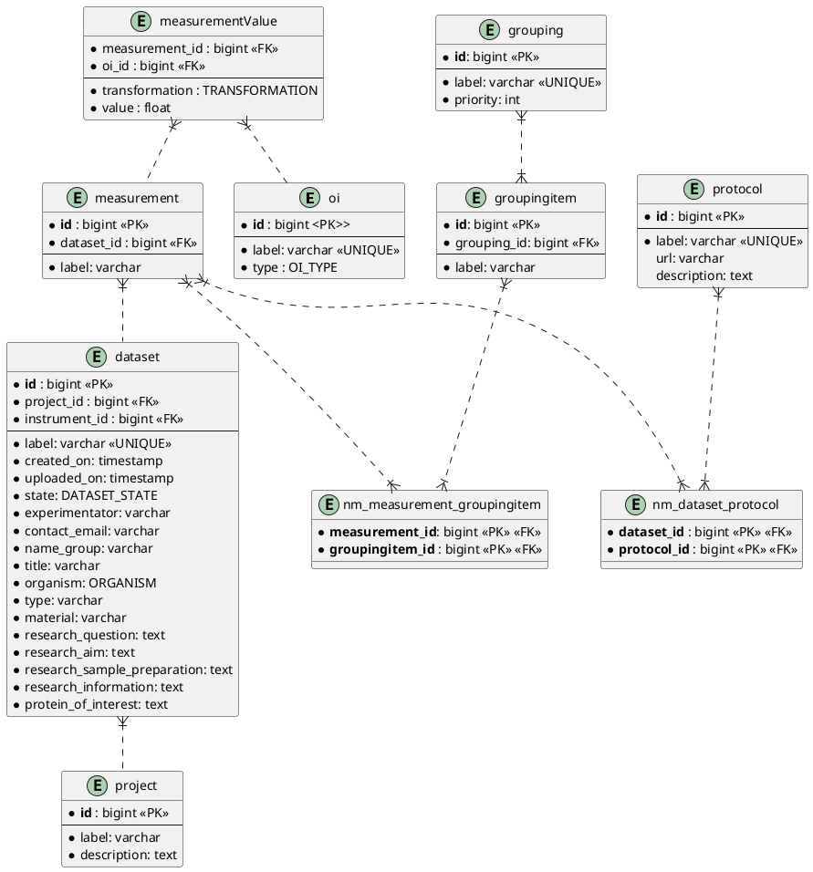

Preliminary ER-Diagram of new SQL implementation (2023-03-31).

```plantuml
@startuml
entity "oi" {
  * **id** : bigint <PK>>
  --
  * label: varchar <<UNIQUE>>
  * type : OI_TYPE
}

entity "measurementValue" as mv {
  * measurement_id : bigint <<FK>>
  * oi_id : bigint <<FK>>
  --
  * transformation : TRANSFORMATION
  * value : float
}

entity "measurement" as m {
  * **id** : bigint <<PK>>
  * dataset_id : bigint <<FK>>
  --
  *label: varchar
}

entity "grouping" as g {
    * **id**: bigint <<PK>>
    --
    * label: varchar <<UNIQUE>>
    * priority: int
}

entity "groupingitem" as gi {
    * **id**: bigint <<PK>>
    * grouping_id: bigint <<FK>>
    --
    * label: varchar
}

entity "nm_measurement_groupingitem" as nm_m_gi {
    * **measurement_id**: bigint <<PK>> <<FK>>
    * **groupingitem_id** : bigint <<PK>> <<FK>>
}

entity "nm_dataset_protocol" as nm_ds_p {
  * **dataset_id** : bigint <<PK>> <<FK>>
  * **protocol_id** : bigint <<PK>> <<FK>>
}

entity "dataset" as ds {  
  * **id** : bigint <<PK>>
  * project_id : bigint <<FK>>
  * instrument_id : bigint <<FK>>
  --
  * label: varchar <<UNIQUE>>
  * created_on: timestamp
  * uploaded_on: timestamp
  * state: DATASET_STATE
  * experimentator: varchar
  * contact_email: varchar
  * name_group: varchar
  * title: varchar
  * organism: ORGANISM
  * type: varchar
  * material: varchar
  * research_question: text
  * research_aim: text
  * research_sample_preparation: text
  * research_information: text
  * protein_of_interest: text
}

entity "protocol" as p {  
  * **id** : bigint <<PK>>
  --
  * label: varchar <<UNIQUE>>
  url: varchar
  description: text
}


entity "project" as pr {  
  * **id** : bigint <<PK>>
  --
  * label: varchar
  * description: text
}

mv }|.. oi
mv }|.. m
m }|.. ds
ds }|.. pr

g }|..|{ gi
gi }|..|{ nm_m_gi
m }|..|{ nm_m_gi

m }|..|{ nm_ds_p
p }|..|{ nm_ds_p

@enduml
```
