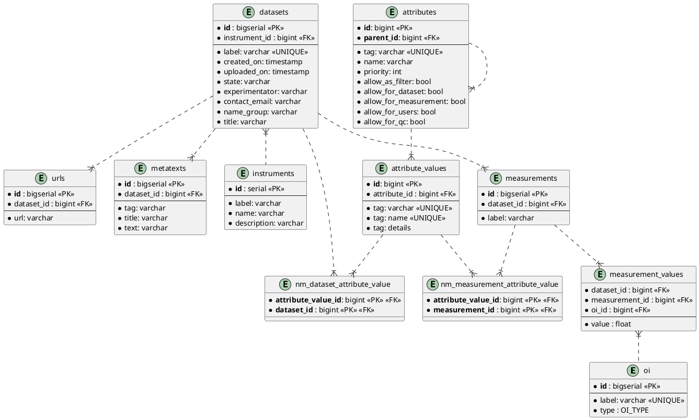
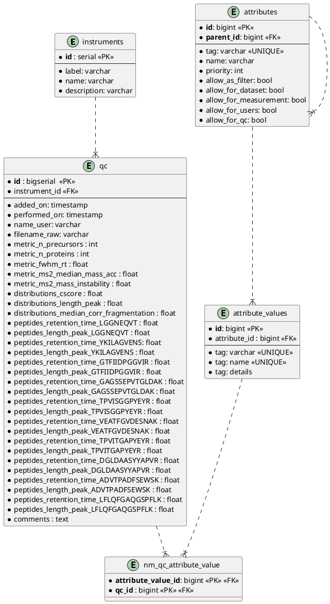
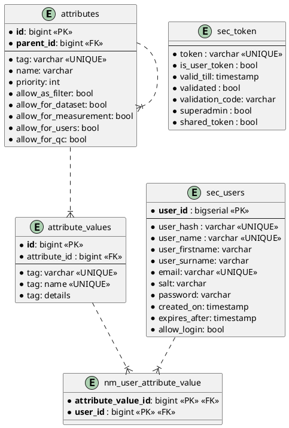
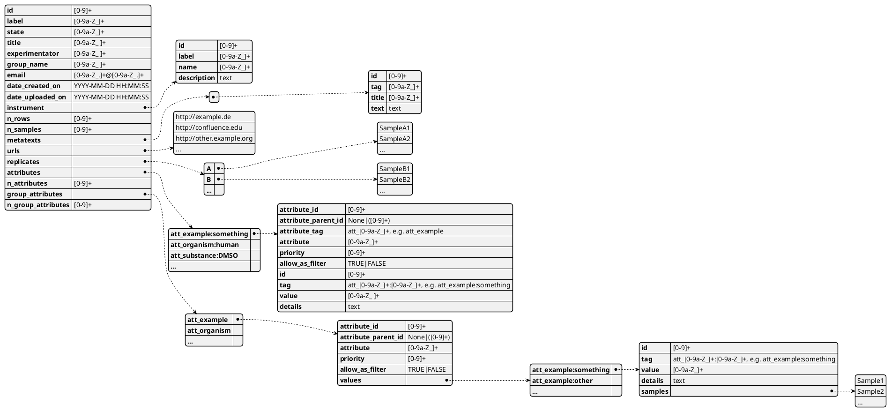
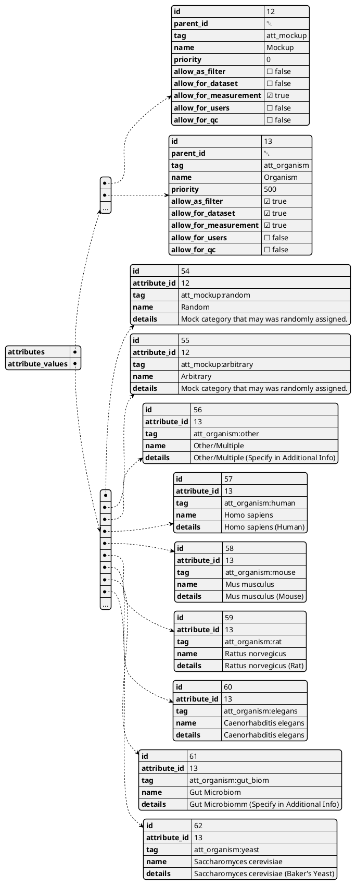

# ER-Diagram of SQL implementation 
updated 2023-07-31, Andreas U Lindner

## 2023-07-31

### .env configuration

#### PostgreSQL

The variables ```datadir``` and ```featurefile``` will be removed since the content will be moved to the database long-term.

* ```n_max_dataset_cached``` - integer, indicates how many datasets are cached.
* ```db-handler``` - The value ```postgresql``` indicates that the postgresql database should be used.
* ```db-ip``` - IP address to the database. Use an IP instead of a name for faster performance.
* ```db-name``` - Name of the database.
* ```db-user``` - PostgreSQL user of the database.
* ```db-pw``` - Password of the PostgreSQL user.

```
token-datadir=/home/andreaslindner/Projects/Major/Immuscience/mitcube_backend/data/dynamic/tokens

db-n_max_dataset_cached = 100
db-featurefile=/home/andreaslindner/Projects/Major/Immuscience/mitcube_backend/data/static/dbs/uniprot/features.txt

db-handler=postgresql
db-ip=127.0.0.1
db-name=ImmunoCubeV2
db-user=immunocube
db-pw=secret
```

#### PandaFile

* ```n_max_dataset_cached``` - integer, indicates how many datasets are cached.
* ```db-handler``` - The ```pandafiles``` indicates that files are used to save and load the data.
* ```db-datadir``` - Directory to the folder which will hold the dataset.
* ```db-featurefile``` - Path to the CSV file with the Protein Database (Protein names, etc.)
* ```db-attributefile``` - Path to JSON files that defines available ```attributes``` and ```attribute values```.
* ```token-datadir``` - Path to directory that will save the tokens.

```
db-n_max_dataset_cached = 100

db-handler=pandafiles
db-datadir=/home/andreaslindner/Projects/Major/Immuscience/mitcube_backend/data/static/datasets
db-featurefile=/home/andreaslindner/Projects/Major/Immuscience/mitcube_backend/data/static/dbs/uniprot/features.txt
db-attributefile=/home/andreaslindner/Projects/Major/Immuscience/mitcube_backend/data/static/attributes.json
token-datadir=/home/andreaslindner/Projects/Major/Immuscience/mitcube_backend/data/dynamic/tokens
```

### PostgreSQL

The column ```dataset_id``` was added to the table ```measurement_values``` to allow grouping without (expensive) joins with ```measurements``` and ```datasets```.



### QC

Table ```qc``` is due to change.

The properties ```Liquid Chromatography```, ```Acquisition Mode```, ```Column Length``` and ```FAIMS CV``` are stored over the ```attributes``` and ```attribute_value``` tables.

The property ```Mass Spectrometer``` is saved using the ```instruments```.



### Security

Tables ```sec_tokens``` and ```sec_users``` are due to change.




### JSON (PandaFile)

#### Class Json

Representation of the JSON object within the ```MCDataset``` class used for Metadata that is also 
saved one-to-one to a JSON file if ```MCPandaDataset``` is used. 



#### Panda Configuration 

If not defined in the SQL database and ```PandaFileDatabase``` is used, definitions of 
```attributes``` and ```attribute_values``` are saved in the file ```attributes.json``` in the
```./backend/data/static/dbs/``` directory.

It is required to link the file using the ```.env``` and the ```db-attributefile``` parameter.


