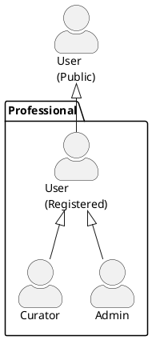
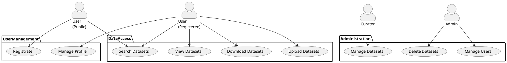

# General

# Example
https://plantuml.com/use-case-diagram

```plantuml
@startuml
skinparam actorStyle awesome

actor :User\n(Public): as UserDefault

package Professional {
    actor :User\n(Registered): as UserRegistered
    actor :Curator: as UserCurator
    actor :Admin: as UserAdmin
    
    UserDefault <|-- UserRegistered
    UserRegistered <|-- UserCurator
    UserRegistered <|-- UserAdmin
}

@enduml
```

```plantuml
@startuml
skinparam actorStyle awesome

actor :User\n(Public): as UserDefault
actor :User\n(Registered): as UserRegistered
actor :Curator: as UserCurator
actor :Admin: as UserAdmin

package UserManagement {
    usecase (Registrate) as (UC_User_Register)
    usecase (Manage Profile) as (UC_User_ManageProfile)
    
    UserDefault --> UC_User_Register
    UserRegistered --> UC_User_ManageProfile
}

package DataAccess {
    usecase (Upload Datasets) as (UC_Data_Upload)
    usecase (Download Datasets) as (UC_Data_Download)
    usecase (Search Datasets) as (UC_Data_Search)
    usecase (View Datasets) as (UC_Data_View)
    
    UserDefault --> UC_Data_Search
        
    UserRegistered --> UC_Data_Search
    UserRegistered --> UC_Data_Upload
    UserRegistered --> UC_Data_Download
    UserRegistered --> UC_Data_View
}

package Administration {
    usecase (Manage Datasets) as (UC_Data_Manage)
    usecase (Delete Datasets) as (UC_Data_Deleted)
    usecase (Manage Users) as (UC_User_Manage)
    
    UserCurator --> UC_Data_Manage
    UserAdmin --> UC_Data_Deleted
    UserAdmin --> UC_User_Manage
    
}


@enduml
```
